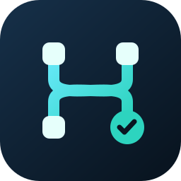

<p align="center">
  
</p>

<h1 align="center">Automaker</h1>
<p align="center">An AI delivery workspace from Jira requirements to Worktree changes</p>

[简体中文](README.zh-CN.md) | English

This repository is a fork of [AutoMaker-Org/automaker](https://github.com/AutoMaker-Org/automaker). It keeps the Kanban board, Git Worktrees, agent execution, and desktop / web UI while adding **Jira synchronization, Herdr sessions, Pi / LiteLLM, multi-repository merge requests, Worktree previews, and acceptance evidence** for the fork's delivery workflow.

Fork repository: [vanvency/automaker](https://github.com/vanvency/automaker). This README describes the current code. External CLIs, model gateways, and preview clusters are optional integrations and must be configured separately.

- [What changed in this fork](#what-changed-in-this-fork)
- [Workflow](#workflow)
- [Quick start](#quick-start)
- [Integrations](#integrations)
- [Run and develop](#run-and-develop)
- [Architecture and data](#architecture-and-data)
- [Documentation](#documentation)

## What changed in this fork

| Area                | Current capability                                                                                                                                                                               |
| ------------------- | ------------------------------------------------------------------------------------------------------------------------------------------------------------------------------------------------ |
| Work Board          | Groups work by Worktree and exposes card / table views, branch actions, and preview controls.                                                                                                    |
| Task Kanban         | Shows tasks by code space, including Jira type, release, child-task scope, requirement changes, delivery details, and attention items.                                                           |
| Jira sync           | Configure JQL, labels, polling, models, and dispatch capacity in Project Settings; preview changes before a manual or scheduled sync and retain run history.                                     |
| Sessions and Reply  | The Agent page exposes Herdr workspaces. Pi execution, Reply, and Conversation share one task pane and history, with reattach after terminal disconnects.                                        |
| Agents and models   | Claude, Codex, Cursor, Gemini, Copilot, OpenCode, and Pi are supported. Pi and OpenCode can discover LiteLLM models, and selectors separate agent from model.                                    |
| Delivery and review | Related repositories, Draft PRs / MRs, and diffs are visible. Failures, conflicts, and interrupted runs stay available for human action; Complete can coordinate GitLab MRs across repositories. |
| Worktree previews   | Deploy an isolated k3s preview for a Worktree, then redeploy, stop, open it, or inject its URL into tests.                                                                                       |
| Acceptance evidence | Cards can show prototype and real screenshots, verification steps, the tested revision, and structured results.                                                                                  |
| Task governance     | Archive and restore tasks with a reason; Similar Works compares overlapping requirements before retiring selected tasks, MRs, or Jira issues.                                                    |

Inherited capabilities include plan approval, dependency graphs, context files, Spec / Ideation, an integrated terminal, themes and shortcuts, GitHub Issues / PRs, and Electron packaging.

## Workflow

1. **Import or create requirements.** Create a card manually, or preview and import matching issues from Project Settings → Jira Sync.
2. **Confirm delivery scope.** Normal Jira sync treats a parent issue and its existing child issues as one card's delivery scope. Related work is grouped under the Epic root. An unsplit Epic / Story waits for Jira decomposition or an explicit human decision.
3. **Run and communicate.** Choose an agent and model, start manually, or dispatch through sync settings. Follow logs or Conversation, then use Reply to answer questions, add requirements, or continue work.
4. **Inspect delivery.** Review diffs, Draft PRs / MRs, preview deployments, and acceptance screenshots. Requirement changes and execution errors remain visible on the card.
5. **Accept and finish.** Mark work complete after human review. The GitLab Complete flow checks merge conditions before merging. Archive work that will not continue, and use Similar Works to review overlap separately.

The board columns are **Backlog → In Progress → Needs Attention → Waiting Review → Done**. Needs Attention groups failed, conflicted, and interrupted states; it is not a required stage. Done means verified in Automaker, while Complete / archival and “code merged” still require their own checks.

Jira status and Automaker execution status are independent. Normal sync does not transition Jira or merge MRs automatically; an agent delivery report is not human acceptance. External cleanup from Similar Works requires an explicit preview and confirmation.

## Quick start

### Requirements

- **Node.js 22.x** (`>=22.0.0 <23.0.0`), npm, and Git.
- At least one installed and authenticated agent provider. Claude CLI is only needed when using the Claude provider.
- For this fork's **Pi task execution, Reply, and Conversation**, the server needs Pi, Herdr, and a reachable LiteLLM gateway.
- Jira sync additionally needs Python 3 and an authenticated Jira CLI. GitHub operations use `gh`; k3s previews need `kubectl` and an image builder.

```bash
git clone https://github.com/vanvency/automaker.git
cd automaker
npm install
npm run dev
```

The interactive launcher lets you choose Web or Electron. The default UI is `http://localhost:3007` and the API is `http://localhost:3008`. Open a project, configure providers and default models in Settings, then configure project integrations in Project Settings.

To run the Web UI and API together in development:

```bash
npm run dev:full
```

## Integrations

### Pi, LiteLLM, and Herdr

Make `pi` and `herdr` available on the **server process PATH**, or set `HERDR_BIN` to the Herdr executable. The default gateway URL is `http://127.0.0.1:4000/v1`:

```bash
export AUTOMAKER_LITELLM_BASE_URL=http://127.0.0.1:4000/v1
# Configure LITELLM_MASTER_KEY in the server environment; never commit it.
npm run init:pi-litellm -- --dry-run
npm run init:pi-litellm
# To use OpenCode with the same gateway:
npm run init:opencode-litellm
```

Pi models are written to `~/.pi/agent/models.json`; OpenCode models are written to `~/.config/opencode/opencode.jsonc`. The `auto`, `leader`, and `worker` aliases must exist as routes in the gateway. The scripts discover gateway models but do not deploy LiteLLM.

Model IDs include `pi:litellm/worker` and `opencode:litellm/worker`. Settings exposes Pi installation status and model refresh. Provider authentication details are in the [Provider architecture guide](docs/server/providers.md).

Herdr maps **project session → Worktree workspace → task tab → agent pane**. Starting a Pi task checks Herdr, installs the missing Pi integration when allowed, and prepares the project session. If Herdr is unavailable, the task fails clearly. Non-task Pi calls still use the CLI. See [Herdr session architecture](docs/herdr-session-architecture.md).

### Jira and GitLab

Configure the site, project, JQL, labels, model, target branch, and reviewer mapping in **Project Settings → Jira Sync**. Use “Test connection → Preview matches and changes → Save → Sync now / scheduled sync”.

The server reuses Jira CLI authentication; Jira tokens are not stored in the browser. Automatic execution can be disabled independently, and pausing sync does not stop an Agent that is already running. Existing `jira-monitor` installations can be migrated from Settings; do not run the old and new schedulers at the same time.

GitLab operations require `GITLAB_TOKEN` or `GITLAB_TOKEN_FILE` on the server, and the host must match the project configuration. See [Jira sync settings](docs/jira-sync-settings.md), [legacy Jira monitor](docs/jira-monitor.md), and [Similar Works](docs/similar-tasks.md).

### Previews and acceptance

Create `.automaker/preview.json` in the project root with an explicit development cluster context and a dedicated namespace. The namespace must have the `automaker.dev/previews-enabled=true` label. Work Board and Task Kanban can deploy the current Worktree contents, including uncommitted changes; redeploy after editing.

The ready preview URL is injected into Worktree tests as `AUTOMAKER_PREVIEW_URL`. An Agent can write `.automaker/acceptance/<featureId>/manifest.json` with prototype images, real screenshots, and checks; the server copies the evidence into the task record.

See [Worktree previews](docs/worktree-previews.md) and [acceptance evidence](docs/task-acceptance-evidence.md). Preview isolation covers the application process and HTTP routes; database and queue isolation depends on the project configuration.

## Run and develop

| Command                                         | Purpose                                                                           |
| ----------------------------------------------- | --------------------------------------------------------------------------------- |
| `npm run dev`                                   | Interactive Web / Electron launcher.                                              |
| `npm run dev:full`                              | Build shared packages and start API plus Web development servers.                 |
| `npm run dev:web`                               | Start only the Web UI; start the API separately.                                  |
| `npm run dev:server`                            | Build shared packages and start the API in development.                           |
| `npm run dev:electron`                          | Electron development mode.                                                        |
| `npm start`                                     | Production launcher; builds first. Use package commands for desktop distribution. |
| `npm run build` / `npm run build:server`        | Build the UI / API and shared packages.                                           |
| `npm run build:electron`                        | Package the desktop app; `:mac`, `:win`, and `:linux` are also available.         |
| `npm run typecheck`                             | UI TypeScript check.                                                              |
| `npm run lint` / `npm run lint:server:errors`   | UI / server lint.                                                                 |
| `npm run test:unit`                             | Vitest unit tests.                                                                |
| `npm run test:server` / `npm run test:packages` | Server / shared-package tests.                                                    |
| `npm test`                                      | Playwright end-to-end tests.                                                      |

### Docker

```bash
docker compose up -d --build
```

The [Compose configuration](docker-compose.yml) provides UI, API, and persistent volumes. Mount project directories and authentication files through a local `docker-compose.override.yml`. On Linux / WSL, set `UID` and `GID` in `.env` to the values from `id -u` and `id -g` before building.

The image does not configure every external integration required by this fork. Prepare Pi / Herdr, Jira CLI, LiteLLM connectivity, and k3s permissions inside the container as needed; `127.0.0.1` refers to the container itself.

### Common environment variables

| Variable                                            | Purpose                                           |
| --------------------------------------------------- | ------------------------------------------------- |
| `AUTOMAKER_WEB_PORT` / `AUTOMAKER_SERVER_PORT`      | Launcher UI / API ports; defaults to 3007 / 3008. |
| `PORT`                                              | API port when started directly.                   |
| `DATA_DIR`                                          | Global server settings and run state.             |
| `AUTOMAKER_API_KEY`                                 | Server API authentication key.                    |
| `ALLOWED_ROOT_DIRECTORY`                            | Restricts the file operation root.                |
| `CORS_ORIGIN`                                       | Allowed cross-origin sources.                     |
| `HERDR_BIN`                                         | Herdr executable path.                            |
| `AUTOMAKER_LITELLM_BASE_URL` / `LITELLM_MASTER_KEY` | LiteLLM gateway and server credential.            |
| `JIRA_CLI_PATH` / `JIRA_CONFIG_FILE`                | Jira CLI and site configuration.                  |
| `GITLAB_TOKEN` / `GITLAB_TOKEN_FILE`                | Server-side GitLab authentication.                |

Agents can read and modify code and execute commands. Git Worktrees isolate branches and working directories but are not an operating-system sandbox; configure file permissions, credentials, and container isolation for your environment. See [DISCLAIMER.md](DISCLAIMER.md).

The Claude provider uses the Claude Agent SDK; its billing can differ from interactive Claude Code. Check [Anthropic's guidance](https://support.claude.com/en/articles/15036540-use-the-claude-agent-sdk-with-your-claude-plan). Other providers follow their own service or gateway authentication and billing.

## Architecture and data

The UI uses React 19, Vite 7, Electron 39, TypeScript, TanStack Router / Query, Zustand, and Tailwind CSS. Express 5, WebSocket, and node-pty provide the API, realtime events, and terminals. Jira workers use Python, and Herdr controls Agent sessions through a local socket.

```text
automaker/
├── apps/ui/         # Web / Electron: Work Board, Task Kanban, sessions, settings
├── apps/server/     # API, Agent execution, Herdr, Jira, delivery, previews
├── libs/            # types, utils, prompts, platform, model-resolver,
│                    # dependency-resolver, git-utils, spec-parser
├── scripts/         # launcher, model setup, Jira workers, migrations, audits
└── docs/            # feature configuration and architecture guides
```

Automaker uses file-based state and does not require an application database:

| Location                                         | Contents                                                          |
| ------------------------------------------------ | ----------------------------------------------------------------- |
| `<project>/.automaker/features/<id>/`            | Task JSON, Agent output, attachments, and acceptance screenshots. |
| `<project>/.automaker/settings.json`             | Project settings and non-secret Jira sync configuration.          |
| `<project>/.automaker/context/`                  | Agent context files.                                              |
| `<project>/.automaker/preview.json`, `previews/` | Preview configuration and runtime state.                          |
| `DATA_DIR`                                       | Global settings, credentials, and server runtime state.           |
| `DATA_DIR/jira-sync/`                            | Per-project sync state, worker configuration, and run history.    |
| `DATA_DIR/task-consolidation/`                   | Similar Works plans and execution records.                        |
| `~/.pi/agent/`, Herdr configuration              | Native Pi sessions, model settings, and Herdr session data.       |

Back up the project `.automaker/` directory, server `DATA_DIR`, and provider session directories together. Do not commit credentials, screenshots, or local configuration to a public repository.

## Documentation

| Guide                                                            | Covers                                                     |
| ---------------------------------------------------------------- | ---------------------------------------------------------- |
| [Jira sync settings](docs/jira-sync-settings.md)                 | UI configuration, migration, idempotency, and run history. |
| [Jira monitor](docs/jira-monitor.md)                             | CLI workflow and advanced hierarchy import.                |
| [Herdr session architecture](docs/herdr-session-architecture.md) | Project / Worktree / task mapping and session lifecycle.   |
| [Provider architecture](docs/server/providers.md)                | Agent routing, models, authentication, and sessions.       |
| [Worktree previews](docs/worktree-previews.md)                   | k3s, image builds, preview URLs, and tests.                |
| [Acceptance evidence](docs/task-acceptance-evidence.md)          | Manifest format, screenshots, and automatic backfill.      |
| [Task archival](docs/task-archive.md)                            | Archive reasons, duplicate references, and restore.        |
| [Similar Works](docs/similar-tasks.md)                           | Requirement comparison and external cleanup.               |
| [Git delivery workflow](docs/checkout-branch-pr.md)              | Branches, commits, Draft PRs, and review.                  |
| [Terminal](docs/terminal.md)                                     | PTY, WebSocket, and terminal configuration.                |
| [Shared packages](docs/llm-shared-packages.md)                   | Monorepo shared modules.                                   |
| [Contributing](CONTRIBUTING.md)                                  | Development conventions and contribution workflow.         |

## Origin and license

Thanks to the [original AutoMaker project and contributors](https://github.com/AutoMaker-Org/automaker). This fork retains the **MIT License** and original copyright and license notices; see [LICENSE](LICENSE).

The project icon uses branch nodes, a converging path, and a completion mark to represent parallel task execution and delivery convergence. Its SVG source is [automaker.svg](apps/ui/public/automaker.svg), shared by the README, app shell, and desktop assets.
