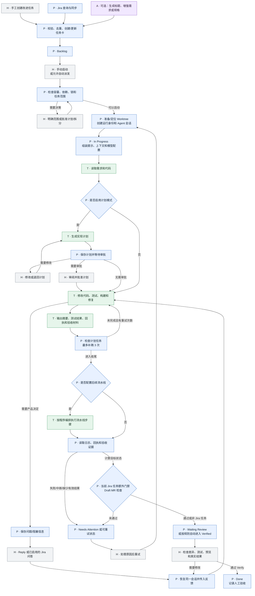
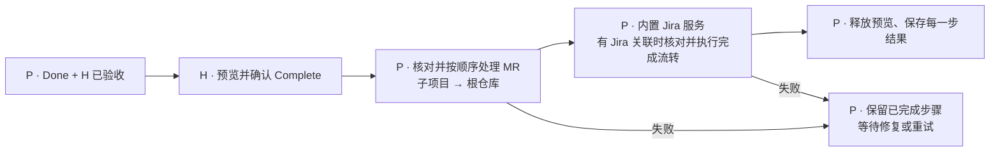

<p align="center">
  
</p>

<h1 align="center">Automaker</h1>
<p align="center">An AI delivery workspace from Jira requirements to Worktree changes</p>

[简体中文](README.zh-CN.md) | English

This repository is a fork of [AutoMaker-Org/automaker](https://github.com/AutoMaker-Org/automaker). It keeps the Kanban board, Git Worktrees, agent execution, and desktop / web UI while adding **Jira synchronization, Herdr sessions, Pi / LiteLLM, multi-repository merge requests, Worktree previews, and acceptance evidence** for the fork's delivery workflow.

Fork repository: [vanvency/automaker](https://github.com/vanvency/automaker). This README describes the current code. External CLIs, model gateways, and preview clusters are optional integrations and must be configured separately.

- [What changed in this fork](#what-changed-in-this-fork)
- [Workflow](#workflow)
- [中文使用流程](#中文使用流程)
- [任务生命周期与职责边界](#任务生命周期与职责边界)
- [Quick start](#quick-start)
- [Integrations](#integrations)
- [Run and develop](#run-and-develop)
- [Architecture and data](#architecture-and-data)
- [Documentation](#documentation)

## What changed in this fork

| Area                | Current capability                                                                                                                                                                               |
| ------------------- | ------------------------------------------------------------------------------------------------------------------------------------------------------------------------------------------------ |
| Work Board          | Groups work by Worktree and exposes card / table views, branch actions, and preview controls.                                                                                                    |
| Task Kanban         | Shows tasks by code space, including Jira type, release, child-task scope, requirement changes, delivery details, and attention items.                                                           |
| Jira sync           | Configure JQL, labels, polling, models, and dispatch capacity in Project Settings; preview changes before a manual or scheduled sync and retain run history.                                     |
| Sessions and Reply  | The Agent page exposes Herdr workspaces. Pi execution, Reply, and Conversation share one task pane and history, with reattach after terminal disconnects.                                        |
| Agents and models   | Claude, Codex, Cursor, Gemini, Copilot, OpenCode, and Pi are supported. Pi and OpenCode can discover LiteLLM models, and selectors separate agent from model.                                    |
| Delivery and review | Related repositories, Draft PRs / MRs, and diffs are visible. Failures, conflicts, and interrupted runs stay available for human action; Complete can coordinate GitLab MRs across repositories. |
| Worktree previews   | Deploy an isolated k3s preview for a Worktree, then redeploy, stop, open it, or inject its URL into tests.                                                                                       |
| Acceptance evidence | Cards can show prototype and real screenshots, verification steps, the tested revision, and structured results.                                                                                  |
| Task governance     | Archive and restore tasks with a reason; Similar Works compares overlapping requirements before retiring selected tasks, MRs, or Jira issues.                                                    |

Inherited capabilities include plan approval, dependency graphs, context files, Spec / Ideation, an integrated terminal, themes and shortcuts, GitHub Issues / PRs, and Electron packaging.

## Workflow

1. **Import or create requirements.** Create a card manually, or preview and import matching issues from Project Settings → Jira Sync.
2. **Confirm delivery scope.** Normal Jira sync treats a parent issue and its existing child issues as one card's delivery scope. Related work is grouped under the Epic root. An unsplit Epic / Story waits for Jira decomposition or an explicit human decision.
3. **Run and communicate.** Choose an agent and model, start manually, or dispatch through sync settings. Follow logs or Conversation, then use Reply to answer questions, add requirements, or continue work.
4. **Inspect delivery.** Review diffs, Draft PRs / MRs, preview deployments, and acceptance screenshots. Requirement changes and execution errors remain visible on the card.
5. **Accept and finish.** Verify work after human review, then preview and confirm Complete. For linked deliveries, completion tracks MR merging, Jira closure, and preview cleanup separately. Archive work that will not continue, and use Similar Works to review overlap separately.

The board columns are **Backlog → In Progress → Needs Attention → Waiting Review → Done**. Needs Attention groups failed, conflicted, and interrupted states; it is not a required stage. Done means verified in Automaker, while Complete / archival and “code merged” still require their own checks.

Jira status and Automaker execution status are independent. Normal sync does not transition Jira or merge MRs automatically; an agent delivery report is not human acceptance. External cleanup from Similar Works requires an explicit preview and confirmation.

## 中文使用流程

### 1. 启动工具并打开项目

按下方 [Quick start](#quick-start) 安装 Node.js 22、npm、Git 和项目依赖，在仓库根目录执行 `npm run dev`，选择 Web 或 Electron。Web 默认入口为 `http://localhost:3007`，API 默认为 `http://localhost:3008`；只运行 `npm run dev:web` 时还需在另一终端运行 `npm run dev:server`。

完成页面上的登录和初始化，创建项目或打开已有 Git 仓库。Web 模式选择的是 **API 服务所在机器上的目录**；使用 Docker 时先挂载项目目录。开始任务前确认当前项目、目标分支和工作区，避免把需求派发到错误仓库。

### 2. 配置 Agent、模型和项目上下文

- 在 **Settings** 中配置所用 Agent 的认证、模型和默认选项；CLI 必须能被服务端进程找到，不能只在浏览器所在机器安装。
- 使用本 fork 的 Pi 任务、Reply 和 Conversation 时，先完成 [Pi / LiteLLM / Herdr 配置](#pi-litellm-and-herdr)，确认网关可达、模型可用。其他 Provider 按各自方式认证。
- 在项目的上下文管理入口添加技术栈、运行命令、编码约定和验收要求。上下文保存在 `.automaker/context/`；不要放入密钥。
- 自动开发本仓库时，让 Agent 先阅读根目录 [AGENTS.md](AGENTS.md)，再按任务定位代码和执行检查。

### 3. 创建任务或导入 Jira 需求

首次使用可先手工创建一个小任务，跑通开发与验收，再开启自动派发。

**手工创建：** 在 **Task Kanban → Add Feature** 填写标题、需求描述、交付范围和验收标准，按需附上原型或截图，选择 Agent / 模型并保存到 Backlog。需要依赖其他任务时先明确依赖关系。

可直接使用这样的任务描述：

```text
目标：给任务列表增加标题搜索。
范围：只修改列表筛选，不改变任务状态和 Jira 同步规则。
验收：输入标题片段后只显示匹配项；清空后恢复；无匹配时显示空状态。
验证：补充筛选行为测试，并运行相关 UI 检查。
```

**Jira 导入：** 先在服务端安装并登录 Jira CLI，再进入 **Project Settings → Jira Sync** 配置站点、项目、JQL、标签、Agent / 模型、目标分支和派发容量。按「测试连接 → 预览匹配与变更 → 保存 → 立即同步」执行；确认导入结果后再启用定时同步与自动执行。关闭自动执行仍可导入任务。

普通同步将匹配的父任务及其已有子任务作为一张卡的交付范围。未拆分的 Epic / Story 会等待 Jira 拆分或明确的人工决定，不会自动扩大需求范围。规则、迁移和运行记录见 [Jira 同步说明](docs/jira-sync-settings.md)。

### 4. 启动开发并跟进执行

在任务卡操作中启动开发；也可按项目设置自动派发。Agent 在任务对应的 Git Worktree 中工作，**Work Board** 用来查看代码空间、分支和交付，**Task Kanban** 用来查看各任务的状态。

| 看板列          | 含义与下一步                                                         |
| --------------- | -------------------------------------------------------------------- |
| Backlog         | 尚未执行；检查需求、依赖和模型后启动。                               |
| In Progress     | 正在执行；查看日志，若启用计划审批则先审阅计划。                     |
| Needs Attention | 失败、冲突或中断；查看原因，处理后继续执行。                         |
| Waiting Review  | 等待审阅；检查变更、测试和验收材料。                                 |
| Done            | Automaker 内已验证；代码合并和 Jira 关闭仍需检查 Complete 交付结果。 |

通过 **Conversation** 查看任务会话，用 **Reply** 回答问题、补充要求或继续开发。出现「需求已更新」时，先比较 Jira 的新要求，再通过 Reply 明确后续范围。暂停 Jira 同步只停止后续同步，不会停止已经运行的 Agent。

### 5. 检查代码、预览和验收材料

审阅任务差异、测试结果及关联仓库的 Draft PR / MR，确认改动符合验收标准；Agent 的完成回复不能替代实际验收。

需要运行页面时，按 [Worktree 预览指南](docs/worktree-previews.md) 配置项目 `.automaker/preview.json`，在看板部署并打开预览。预览包含当前 Worktree 的未提交改动，修改代码后需重新部署；就绪地址通过 `AUTOMAKER_PREVIEW_URL` 注入 Worktree 测试。

需要图文验收时，让 Agent 按 [验收材料规范](docs/task-acceptance-evidence.md) 产出 `.automaker/acceptance/<featureId>/manifest.json`、原型图、真实运行截图和检查结果，再在任务卡查看「验收结果」。无法验证的项目应明确标记，不能用原型图代替真实运行截图。

### 6. 人工验收并完成交付

验收不通过时，通过 Reply 或 **Request Changes** 提出修改；验收通过后使用 **Verify / Mark as Verified**，任务进入 Done。

在 Done 卡片点击 **Complete**，先检查预览中的 MR、目标分支、被审阅版本、Jira 终态和阻塞项，再确认执行。有关联交付时，流程依次记录 **MR 合并 → Jira 关闭 → 预览资源释放**；这与普通 Jira 同步是不同操作。完成后保留交付回执，归档需单独操作。

某一步失败时，卡片保留在 Done，并显示已完成步骤和失败原因。可以请求 Agent 修复前置问题，刷新后重试 Complete；如果修复改了代码，需要重新验收。详见 [交付进度说明](docs/task-delivery-progress.md)。

不再推进的任务使用 **Archive Task**，填写原因和说明；重复任务还需选择被重复的任务。归档保留代码、会话和材料，可从 Archived Tasks 恢复，不会自动关闭 Jira 或 MR。运行中的任务先停止；外部重复需求清理由 **Similar Works** 单独预览和确认。

### 7. 常见问题与恢复

| 现象                      | 处理方式                                                                                                                                                                    |
| ------------------------- | --------------------------------------------------------------------------------------------------------------------------------------------------------------------------- |
| 页面打开但 API 不可用     | 确认服务端已启动，检查 3008 端口、代理配置和登录状态。                                                                                                                      |
| Agent 或模型启动失败      | 查看服务端日志和 Provider 状态，检查服务端 PATH、认证与网关模型；Pi 任务还需检查 Herdr。                                                                                    |
| Conversation 断开         | 等待重新附着或重新打开会话；认证失效时重新登录。PTY 断开不等于 Agent 已停止，先确认运行状态再重试任务。                                                                     |
| Jira 任务未派发           | 查看同步预览、运行记录、自动执行开关、容量、依赖和拆分阻塞；不要同时运行旧 monitor 和新调度器。                                                                             |
| Done 中找不到旧任务       | 使用搜索或 Done 标题的「+N 更早」显示超过 7 天的记录。符合保留策略的旧 Worktree 可能已释放，后续 Reply / Agent 执行或打开 Conversation 时会尝试重建；任务记录与会话仍保留。 |
| Complete 被阻塞或中途失败 | 查看具体交付步骤，修复冲突、权限或必填项后重新预览与确认，不要直接修改任务 JSON 来跳过检查。                                                                                |

备份项目 `.automaker/`、服务端 `DATA_DIR` 和 Provider 会话目录；数据位置见 [Architecture and data](#architecture-and-data)。

## 任务生命周期与职责边界

Automaker 程序、平台辅助 AI 和任务 Agent 协作执行任务，用户负责范围决策和验收。平台没有一个负责所有环节的“总指挥 Agent”：

| 标记                   | 执行者                                                                  | 负责内容                                                         |
| ---------------------- | ----------------------------------------------------------------------- | ---------------------------------------------------------------- |
| **P · Automaker 程序** | UI、API、调度器、状态管理和外部接口代码                                 | 导入、存储、去重、派发、Worktree、会话、测试结果、状态和交付步骤 |
| **A · 平台辅助 AI**    | 标题、需求增强、规格、Ideation、需求变更摘要等按需调用的模型            | 生成或总结内容，不直接拥有任务代码修改流程                       |
| **T · 任务 Agent**     | 任务选择的 Claude、Codex、Cursor、Gemini、Copilot、OpenCode 或 Pi Agent | 阅读仓库、规划实现、修改代码、执行测试、修复失败并报告结果       |
| **H · 用户**           | 任务创建者和验收者                                                      | 确定范围、批准计划、回答问题、检查交付并确认完成                 |

手工创建的改进任务不需要 Jira。Jira 同步是可选的需求入口；在当前实现中，Jira 同步、评论回写和 Complete 阶段的 Jira 流转仍由内置服务及脚本执行，尚未拆成可插拔的 Jira Plugin。



计划模式中的“规划”和后续“开发”通常由同一个任务 Agent 完成。Automaker 程序负责决定是否需要审批、解析计划、保存任务进度和恢复会话；它本身不会替任务 Agent 修改业务代码。流水线同样由程序编排，流水线步骤中的智能操作仍由任务 Agent 执行，测试命令由测试程序返回结果。

`AgentExecutor`、`ExecutionService` 和 Herdr 会话管理属于程序代码。流水线步骤即使叫 Review，也不代表它使用了独立、隔离的审核 Agent。自动进入 `verified` 也不等于人工验收：Agent 的输出和回执不能替代对实际功能的检查。

平台辅助 AI 按功能需要调用，并非每张任务都会经过：

| 场景                   | 平台辅助 AI           | Automaker 程序                  |
| ---------------------- | --------------------- | ------------------------------- |
| 创建任务               | 生成标题、增强描述    | 展示或保存生成内容              |
| Spec / Ideation        | 生成规格、任务建议    | 创建卡片、维护任务关系          |
| 执行期间 Jira 需求变化 | 总结变化点            | 将摘要传给运行中的任务会话      |
| 提交或 PR 辅助功能     | 生成提交信息、PR 描述 | 根据用户操作调用 Git 或远端接口 |

Jira 需求变更通知可能影响正在运行的任务，应在后续插件配置中作为独立选项。当前 [Draft MR 门禁](apps/server/src/services/draft-mr-review-gate.ts) 也仍会检查 Jira 任务能否进入 Review/Done；它与“任务只负责开发”的目标存在冲突，应移到独立交付阶段。

开发结束后的代码交付和 Jira 流转是独立阶段：



任务 Agent 的开发完成不等于 MR 已合并，也不等于 Jira 已关闭。当前 Complete 流程核对关联 MR、按需合并、关闭关联 Jira 并释放预览；没有 Jira 关联时跳过 Jira 步骤。未来 Jira Plugin 化后，Jira 相关步骤还应由项目配置控制，手工创建的非 Jira 任务仍可完整开发、验收和完成。

实现入口：[任务编排](apps/server/src/services/execution-service.ts)、[Agent 执行与计划审批](apps/server/src/services/agent-executor.ts)、[流水线编排](apps/server/src/services/pipeline-orchestrator.ts)、[Complete 交付流程](apps/server/src/routes/features/routes/complete.ts)。

## Quick start

### Requirements

- **Node.js 22.x** (`>=22.0.0 <23.0.0`), npm, and Git.
- At least one installed and authenticated agent provider. Claude CLI is only needed when using the Claude provider.
- For this fork's **Pi task execution, Reply, and Conversation**, the server needs Pi, Herdr, and a reachable LiteLLM gateway.
- Jira sync additionally needs Python 3 and an authenticated Jira CLI. GitHub operations use `gh`; k3s previews need `kubectl` and an image builder.

```bash
git clone https://github.com/vanvency/automaker.git
cd automaker
npm install
npm run dev
```

The interactive launcher lets you choose Web or Electron. The default UI is `http://localhost:3007` and the API is `http://localhost:3008`. Open a project, configure providers and default models in Settings, then configure project integrations in Project Settings.

To run the Web UI and API together in development:

```bash
npm run dev:full
```

## Integrations

### Pi, LiteLLM, and Herdr

Make `pi` and `herdr` available on the **server process PATH**, or set `HERDR_BIN` to the Herdr executable. The default gateway URL is `http://127.0.0.1:4000/v1`:

```bash
export AUTOMAKER_LITELLM_BASE_URL=http://127.0.0.1:4000/v1
# Configure LITELLM_MASTER_KEY in the server environment; never commit it.
npm run init:pi-litellm -- --dry-run
npm run init:pi-litellm
# To use OpenCode with the same gateway:
npm run init:opencode-litellm
```

Pi models are written to `~/.pi/agent/models.json`; OpenCode models are written to `~/.config/opencode/opencode.jsonc`. The `auto`, `leader`, and `worker` aliases must exist as routes in the gateway. The scripts discover gateway models but do not deploy LiteLLM.

Model IDs include `pi:litellm/worker` and `opencode:litellm/worker`. Settings exposes Pi installation status and model refresh. Provider authentication details are in the [Provider architecture guide](docs/server/providers.md).

Herdr maps **project session → Worktree workspace → task tab → agent pane**. Starting a Pi task checks Herdr, installs the missing Pi integration when allowed, and prepares the project session. If Herdr is unavailable, the task fails clearly. Non-task Pi calls still use the CLI. See [Herdr session architecture](docs/herdr-session-architecture.md).

### Jira and GitLab

Configure the site, project, JQL, labels, model, target branch, and reviewer mapping in **Project Settings → Jira Sync**. Use “Test connection → Preview matches and changes → Save → Sync now / scheduled sync”.

The server reuses Jira CLI authentication; Jira tokens are not stored in the browser. Automatic execution can be disabled independently, and pausing sync does not stop an Agent that is already running. Existing `jira-monitor` installations can be migrated from Settings; do not run the old and new schedulers at the same time.

GitLab operations require `GITLAB_TOKEN` or `GITLAB_TOKEN_FILE` on the server, and the host must match the project configuration. See [Jira sync settings](docs/jira-sync-settings.md), [legacy Jira monitor](docs/jira-monitor.md), and [Similar Works](docs/similar-tasks.md).

### Previews and acceptance

Create `.automaker/preview.json` in the project root with an explicit development cluster context and a dedicated namespace. The namespace must have the `automaker.dev/previews-enabled=true` label. Work Board and Task Kanban can deploy the current Worktree contents, including uncommitted changes; redeploy after editing.

The ready preview URL is injected into Worktree tests as `AUTOMAKER_PREVIEW_URL`. An Agent can write `.automaker/acceptance/<featureId>/manifest.json` with prototype images, real screenshots, and checks; the server copies the evidence into the task record.

See [Worktree previews](docs/worktree-previews.md) and [acceptance evidence](docs/task-acceptance-evidence.md). Preview isolation covers the application process and HTTP routes; database and queue isolation depends on the project configuration.

## Run and develop

| Command                                         | Purpose                                                                           |
| ----------------------------------------------- | --------------------------------------------------------------------------------- |
| `npm run dev`                                   | Interactive Web / Electron launcher.                                              |
| `npm run dev:full`                              | Build shared packages and start API plus Web development servers.                 |
| `npm run dev:web`                               | Start only the Web UI; start the API separately.                                  |
| `npm run dev:server`                            | Build shared packages and start the API in development.                           |
| `npm run dev:electron`                          | Electron development mode.                                                        |
| `npm start`                                     | Production launcher; builds first. Use package commands for desktop distribution. |
| `npm run build` / `npm run build:server`        | Build the UI / API and shared packages.                                           |
| `npm run build:electron`                        | Package the desktop app; `:mac`, `:win`, and `:linux` are also available.         |
| `npm run typecheck`                             | UI TypeScript check.                                                              |
| `npm run lint` / `npm run lint:server:errors`   | UI / server lint.                                                                 |
| `npm run test:unit`                             | Vitest unit tests.                                                                |
| `npm run test:server` / `npm run test:packages` | Server / shared-package tests.                                                    |
| `npm test`                                      | Playwright end-to-end tests.                                                      |

### Docker

```bash
docker compose up -d --build
```

The [Compose configuration](docker-compose.yml) provides UI, API, and persistent volumes. Mount project directories and authentication files through a local `docker-compose.override.yml`. On Linux / WSL, set `UID` and `GID` in `.env` to the values from `id -u` and `id -g` before building.

The image does not configure every external integration required by this fork. Prepare Pi / Herdr, Jira CLI, LiteLLM connectivity, and k3s permissions inside the container as needed; `127.0.0.1` refers to the container itself.

### Common environment variables

| Variable                                            | Purpose                                           |
| --------------------------------------------------- | ------------------------------------------------- |
| `AUTOMAKER_WEB_PORT` / `AUTOMAKER_SERVER_PORT`      | Launcher UI / API ports; defaults to 3007 / 3008. |
| `PORT`                                              | API port when started directly.                   |
| `DATA_DIR`                                          | Global server settings and run state.             |
| `AUTOMAKER_API_KEY`                                 | Server API authentication key.                    |
| `ALLOWED_ROOT_DIRECTORY`                            | Restricts the file operation root.                |
| `CORS_ORIGIN`                                       | Allowed cross-origin sources.                     |
| `HERDR_BIN`                                         | Herdr executable path.                            |
| `AUTOMAKER_LITELLM_BASE_URL` / `LITELLM_MASTER_KEY` | LiteLLM gateway and server credential.            |
| `JIRA_CLI_PATH` / `JIRA_CONFIG_FILE`                | Jira CLI and site configuration.                  |
| `GITLAB_TOKEN` / `GITLAB_TOKEN_FILE`                | Server-side GitLab authentication.                |

Agents can read and modify code and execute commands. Git Worktrees isolate branches and working directories but are not an operating-system sandbox; configure file permissions, credentials, and container isolation for your environment. See [DISCLAIMER.md](DISCLAIMER.md).

The Claude provider uses the Claude Agent SDK; its billing can differ from interactive Claude Code. Check [Anthropic's guidance](https://support.claude.com/en/articles/15036540-use-the-claude-agent-sdk-with-your-claude-plan). Other providers follow their own service or gateway authentication and billing.

## Architecture and data

The UI uses React 19, Vite 7, Electron 39, TypeScript, TanStack Router / Query, Zustand, and Tailwind CSS. Express 5, WebSocket, and node-pty provide the API, realtime events, and terminals. Jira workers use Python, and Herdr controls Agent sessions through a local socket.

```text
automaker/
├── apps/ui/         # Web / Electron: Work Board, Task Kanban, sessions, settings
├── apps/server/     # API, Agent execution, Herdr, Jira, delivery, previews
├── libs/            # types, utils, prompts, platform, model-resolver,
│                    # dependency-resolver, git-utils, spec-parser
├── scripts/         # launcher, model setup, Jira workers, migrations, audits
└── docs/            # feature configuration and architecture guides
```

Automaker uses file-based state and does not require an application database:

| Location                                         | Contents                                                          |
| ------------------------------------------------ | ----------------------------------------------------------------- |
| `<project>/.automaker/features/<id>/`            | Task JSON, Agent output, attachments, and acceptance screenshots. |
| `<project>/.automaker/settings.json`             | Project settings and non-secret Jira sync configuration.          |
| `<project>/.automaker/context/`                  | Agent context files.                                              |
| `<project>/.automaker/preview.json`, `previews/` | Preview configuration and runtime state.                          |
| `DATA_DIR`                                       | Global settings, credentials, and server runtime state.           |
| `DATA_DIR/jira-sync/`                            | Per-project sync state, worker configuration, and run history.    |
| `DATA_DIR/task-consolidation/`                   | Similar Works plans and execution records.                        |
| `~/.pi/agent/`, Herdr configuration              | Native Pi sessions, model settings, and Herdr session data.       |

Back up the project `.automaker/` directory, server `DATA_DIR`, and provider session directories together. Do not commit credentials, screenshots, or local configuration to a public repository.

## Documentation

| Guide                                                            | Covers                                                                           |
| ---------------------------------------------------------------- | -------------------------------------------------------------------------------- |
| [Jira sync settings](docs/jira-sync-settings.md)                 | UI configuration, migration, idempotency, and run history.                       |
| [Jira monitor](docs/jira-monitor.md)                             | CLI workflow and advanced hierarchy import.                                      |
| [Herdr session architecture](docs/herdr-session-architecture.md) | Project / Worktree / task mapping and session lifecycle.                         |
| [Provider architecture](docs/server/providers.md)                | Agent routing, models, authentication, and sessions.                             |
| [Worktree previews](docs/worktree-previews.md)                   | k3s, image builds, preview URLs, and tests.                                      |
| [Acceptance evidence](docs/task-acceptance-evidence.md)          | Manifest format, screenshots, and automatic backfill.                            |
| [Task archival](docs/task-archive.md)                            | Archive reasons, duplicate references, and restore.                              |
| [Similar Works](docs/similar-tasks.md)                           | Requirement comparison and external cleanup.                                     |
| [Git delivery workflow](docs/checkout-branch-pr.md)              | Branches, commits, Draft PRs, and review.                                        |
| [Terminal](docs/terminal.md)                                     | PTY, WebSocket, and terminal configuration.                                      |
| [Shared packages](docs/llm-shared-packages.md)                   | Monorepo shared modules.                                                         |
| [Agent development guide](AGENTS.md)                             | Repository workflow, code boundaries, and validation commands for coding agents. |
| [Contributing](CONTRIBUTING.md)                                  | Development conventions and contribution workflow.                               |

## Origin and license

Thanks to the [original AutoMaker project and contributors](https://github.com/AutoMaker-Org/automaker). This fork retains the **MIT License** and original copyright and license notices; see [LICENSE](LICENSE).

The project icon uses branch nodes, a converging path, and a completion mark to represent parallel task execution and delivery convergence. Its SVG source is [automaker.svg](apps/ui/public/automaker.svg), shared by the README, app shell, and desktop assets.
